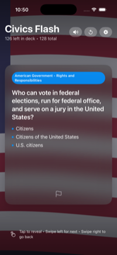

# Civics Flash

Civics Flash is an iPhone and iPad study app for the civics portion of the U.S. naturalization test.

It turns the USCIS civics questions into a simple flashcard-style review flow, making it easier to practice key facts, names, dates, and government concepts in short study sessions.

  

 

  <strong><a href="CHEAT_SHEET.md">Study cheat sheet</a></strong> 
  <em>Mostly the stuff I find harder to memorize. You may find it useful, or you may not.</em>

## Highlights

- Flashcard-style practice for U.S. citizenship civics questions
- Built for iPhone and iPad
- Companion cheat sheet for the facts that are easy to mix up
- Question content sourced from USCIS study materials

## Screenshot

  

